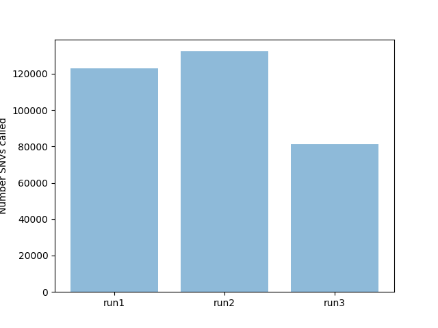
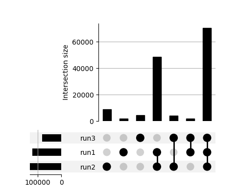
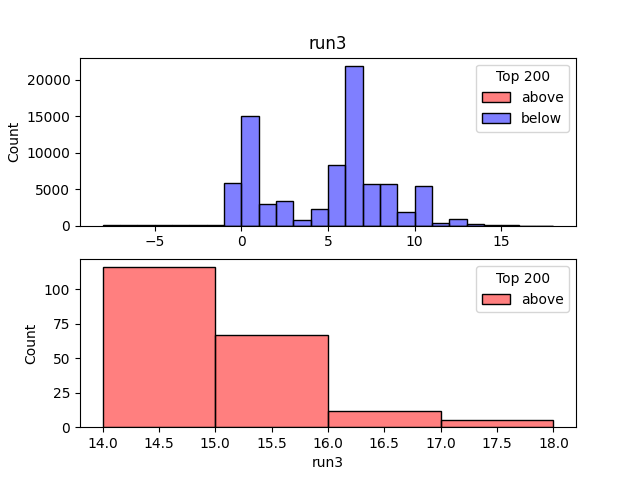
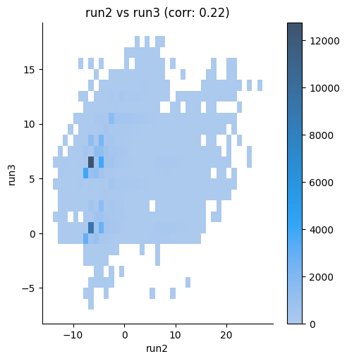
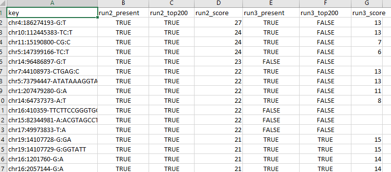

The purpose of this tool is to provide convenient utilities to evaluate calling and annotation differences between VCF files.

The common use case would be that different technical approaches have been used for the same biological samples, and that the impact from these choices need to be understood.

### Install dependencies

This is recommended to do within a `venv` environment ([link](https://docs.python.org/3/library/venv.html))

```
pip install -r requirements.txt
```

### Usage

Inputs can be gzipped:

```
python compare_vcf.py \
    --inputs run1.vcf.gz run2.vcf.gz run3.vcf.gz \
    --labels first second third \
    --outdir testout
```

Extended command:

```
python compare_vcf.py \
    --inputs run1.vcf.gz run2.vcf.gz run3.vcf.gz \
    --labels first second third \
    --outdir testout \
    --scorekey RankScore \
    --topn 200
```

#### Other settings

* `--scorekey` Scoring in INFO field determining what variants are "top ranked".
* `--topn` Among the "top ranked" variants, how many to study.
* `--contig "chr1"` Limit analysis to one contig.

### Outputs

Number called variants among the different vcf-files.



Overlaps among the called variants. More info on the upset chart can be found [here](https://en.wikipedia.org/wiki/UpSet_Plot)



If a scoring metric is provided, histograms of the scores are generated for each dataset.



If a scoring metric is provided, heatmaps comparing the number of features with shared scorings are also generated.



Score table. This will be extended.



### Planned extensions

* More detailed annotation information in the output table.
* Use the GIAB as a reference base line.
